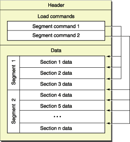

# The Mach-O Format

The Mach-O file format is the executable format of choice for XNU and dyld.
It serves a purpose analog to what ELF or PE do; to put it simply, it describes a portion of an address space.
Support for multi-architecture executables is also provided thanks to the fat format, which allows you to join multiple different architecture Mach-OS letting the kernel pick which to load. Note that it is possible to influence this with posix_spawn APIs.

# Working with Mach-Os

1. otool is provided out-of-the-box with the xcode cli utils.
2. jtool, by Jonathan Levin, author of MOXiI and MOXiI II, is an analog but more flexible and advanced tool. On the other hand, it lacks support for disassembling architectures other than arm64.
2. lipo is a tool for working with fat files
3. Apple headers, specifically <mach-o/fat.h>.

# General structure
This image from Apple documentation illustrates pretty well how a Mach-O file is composed.



The **header** is the first thing you will encounter while parsing a Mach-O file. It is always located at the very beginning.

Immediately following the header there are the **load commands**, these commands describe what the content of the file is. They give us an idea of how the file is structured. Particularly, each command describes its own **segment** a piece of data (located in the **data** part of the Mach-O file), specifying where it is located (offset) in the file, and its size. Each specific command may also contain other values, specific to its segment only.

Finally, we have the **data**. This part of the file contains actual data. It also contains, as you are probably wondering, the executable code of the Mach-O. The structure of this part is described exactly by the load commands discussed above, the layout is really the same. Each segment may be divided into various **sections** which simply exist to sub-categorize the data in each segment. For example, the `__TEXT` segment contains various sections, among those the `__text` section, that contains the actual executable machine bytes. Another section is the `__cstring`, which only contains hardcoded C strings used in the program.  

# Fat Mach-Os

A fat Mach-O is simply made out of a fat header, which contains a magic value (which allows you to derive endianess of the fat image; in case magic equals FAT_CIGAM, remember to endian flip your values) and multiple architecture structures.
Each architecture is defined as a section of the fat file itself (which is itself nothing more than a thin Mach-O) and is specific for a particular cpu(sub)type.


# mach_header(_64)
There are two structs (for both _x86_ and _x64_ architectures) for representing a Mach-O header:

```
struct mach_header; // 32-bit Mach-O format
struct mach_header_64; // 64-bit Mach-O format
```
The differences are minimal, just a `reserved` field added to the 64-bit header.

As per loader.h, the header file defining Mach-O constants and structures:
```
struct mach_header(_64) {
	uint32_t	magic;			/* mach magic number identifier */
	cpu_type_t	cputype;		/* cpu specifier */
	cpu_subtype_t	cpusubtype;	/* machine specifier */
	uint32_t	filetype;		/* type of file */
	uint32_t	ncmds;			/* number of load commands */
	uint32_t	sizeofcmds;		/* the size of all the load commands */
	uint32_t	flags;			/* flags */
	(uint32_t	reserved;		/* reserved; 64 bit only */)
};
#define	MH_MAGIC	0xfeedface	/* the mach magic number */
#define	MH_MAGIC_64 0xfeedfacf 		/* the 64-bit mach magic number */
```
### Types of Mach-Os
```
// These shuld be representing userland Mach-Os
#define	MH_EXECUTE	0x2		/* demand paged executable file (executable) */
#define	MH_FVMLIB	0x3		/* fixed VM shared library file (???) */
#define	MH_DYLIB	0x6		/* dynamically bound shared library */
#define	MH_DYLINKER	0x7		/* dynamic link editor */
#define	MH_BUNDLE	0x8		/* dynamically bound bundle file */

// Compile-time Mach-Os, Generic address-space Mach-Os, ???
#define	MH_OBJECT	0x1		/* relocatable object file (.o) */
#define	MH_CORE		0x4		/* core file */
#define	MH_PRELOAD	0x5		/* preloaded executable file */
#define	MH_DYLIB_STUB	0x9		/* shared library stub for static */
					/*  linking only, no section contents */
#define	MH_DSYM		0xa		/* companion file with only debug */
					/*  sections */

// Kernel Mach-Os
#define	MH_KEXT_BUNDLE	0xb		/* x86_64 kexts */
```
# Load Commands

# Segments

# Sections

# nlist / nlist_64

# Symbols

# Lazy Linking

# Position Independent Executables
 a.k.a. ASLR-Enabled Executables.
 PIE Flag is in the *thin* mach_header with value 0x200000
 Minus that from the original flag value will disable ASLR, and vice verse

# Special Segments
	__PAGEZERO is a special segment with *ZERO* disk space and takes a page in VM.
	When code access NULL, it will land there
	Mach-O containing __RESTRICT/__restrict will be flagged by dyld and thus DYLD_INSERT_LIBRARIES EnvVar will be ignored.(This is added after iOS6)

# Other common load commands

# Malformed Mach-O
By altering Mach-O headers. Different issues would happen within dyld.

Sometimes it can protect the binary from being analyzed

Sometimes it's a 0Day and can help bypass Code-Signature-Verification

Examples:

~~[MachOProtector](https://github.com/Naville/MachOProtecter)~~

Won't Work After iOS 8.1 or OS X 10.11

[yalu](https://github.com/kpwn/yalu)

Maybe. Didn't Check SRC.

[Pangu8](http://8.pangu.io)


# Two Level Namespace

# The Mach-O Address Space in xnu/dyld based OSes

# Dyld Shared Cache
Download the latest dyld source from [here](http://opensource.apple.com/source/dyld/).

open `./launch-cache/dsc_extractor.cpp` and change `#if 0` to `#if 1`.
<br>
Then just `clang++ -o dsc_extractor dsc_extractor.cpp dsc_iterator.cpp`
and run `dsc_extractor` on the cache to extract.

##### Known Issues:
 Seems like segment VM Address is wrong. So the binary is not class-dump able (Just use runtime dump instead)
 not nm-able (solution: simply replace `LC_SEGMENT_SPLIT_INFO` to  `LC_SOURCE_VERSION`)

# References
-	[Apple OS X ABI Mach-O File Format Reference](https://developer.apple.com/library/mac/documentation/DeveloperTools/Conceptual/MachORuntime/)
-	[loader.h (mach-o file format .h)](http://www.opensource.apple.com/source/xnu/xnu-3248.20.55/EXTERNAL_HEADERS/mach-o/loader.h)
